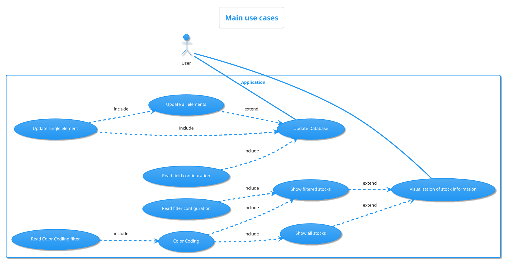
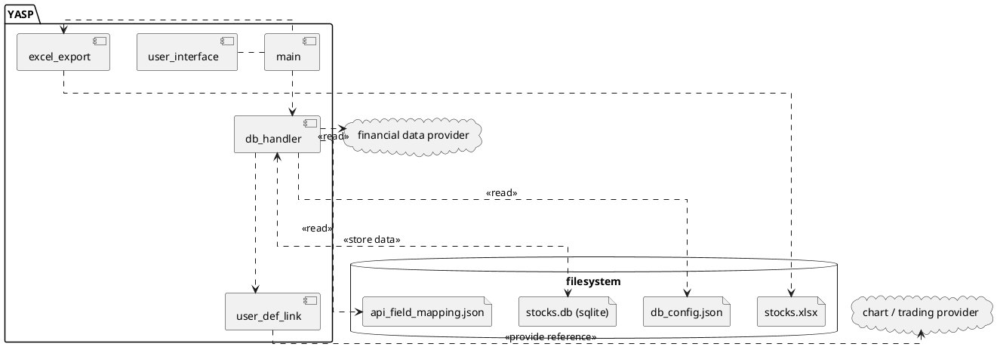
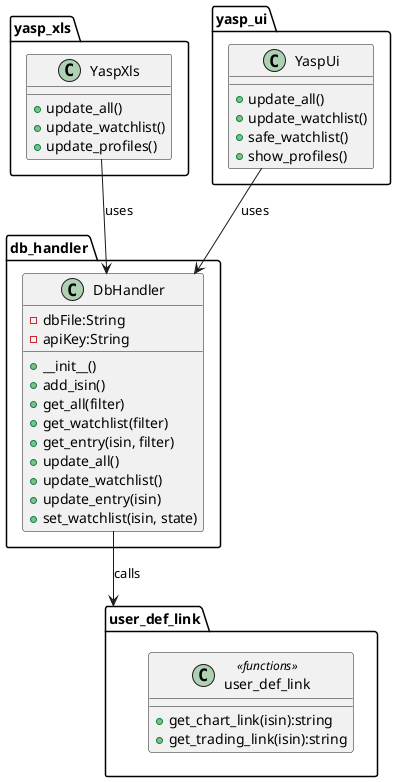

# Software Architecture

The following section describe the high level software architecture

## Use Cases

The following diagram show the main use cases of this application:

## Context Diagram

## Class Diagram

